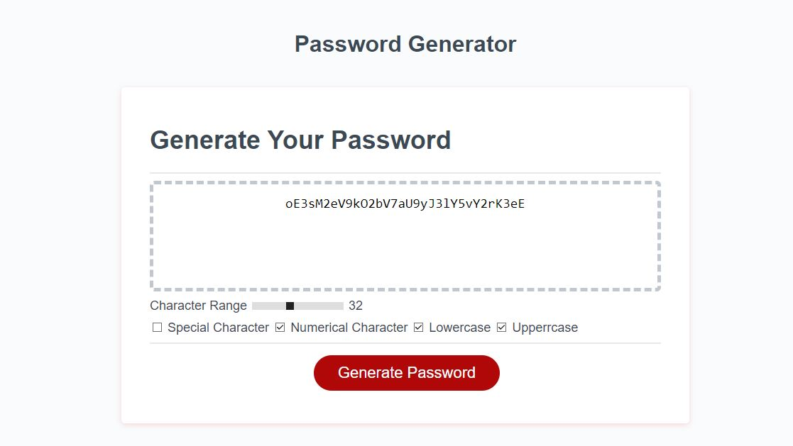

# password-generator
Create your unique password.

##Discription

Password Generator is a system that generate unique password for your strong security purpose.
It can generate unique password based on your preference either combination of letter, number, symbol, uppercase, lowercase character.

##index.html

Contain HTML source code for user interface.

##style.css

CSS code that provide unique layout to HTML structure.

##script.js

Javascript Code for actual working function of the program that is created.

#image

Screenshot of actual program.

Program Diployed Link: https://ajinthapa2000.github.io/password-generator/

##screenshot

